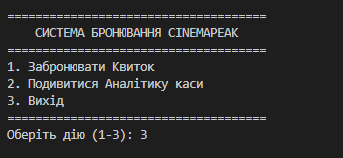
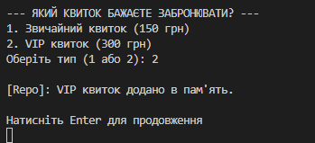
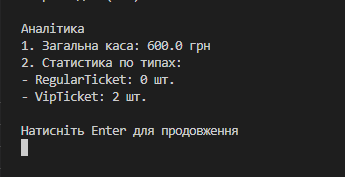
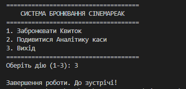

# Звіт лабораторної роботи: Контейнеризація застосунків

**Мета:** Налаштувати інтерактивний запуск консольного додатка CinemaPeak у Docker.

## Кроки виконання та команди

1. **Очищення та локальний запуск:**
   ```bash
   dotnet clean
   dotnet run --project src/CinemaPeak.Console

  1. Головний екран 
  2. Бронювання квитка 
  3. Оновлена аналітика 
  4. Вихід 

**Основні результати роботи:**
* **Розробка логіки:** Створено стійкий алгоритм життєвого циклу програми (за допомогою конструкції `while(true)` та операторів розгалуження `if/else`), що дозволило розв'язати проблему миттєвого завершення процесу та забезпечити збереження стану даних (кількості квитків та каси) в оперативній пам'яті під час сесії користувача.
* **Оптимізація збірки:** Налаштовано багатоетапний `Dockerfile` (multi-stage build), який розділяє процеси компіляції додатка (.NET SDK) та його фінального запуску (.NET Runtime), що суттєво зменшило кінцевий розмір Docker-образу.
* **Інтерактивність у контейнері:** Успішно вирішено проблему передачі потоків введення-виведення (`stdin`/`stdout`) всередині ізольованого середовища завдяки використанню термінальних прапорців режиму сумісності `-it` (`docker run --rm -it`).