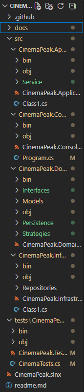

# Наслідування (Inheritance): StandardTicket та VipTicket наслідуються від абстрактного класу Ticket.
# Паттерн Strategy: Сервіс BookingService не залежить від конкретної логіки знижок, а використовує інтерфейс IDiscountStrategy.
# Паттерн Repository: Доступ до даних ізольовано через ITicketRepository, що дозволяє легко замінити збереження в пам'яті на базу даних у майбутньому.
# Persistence: Клас JsonDataStore<T> забезпечує асинхронне збереження доменних об'єктів у JSON-файл.